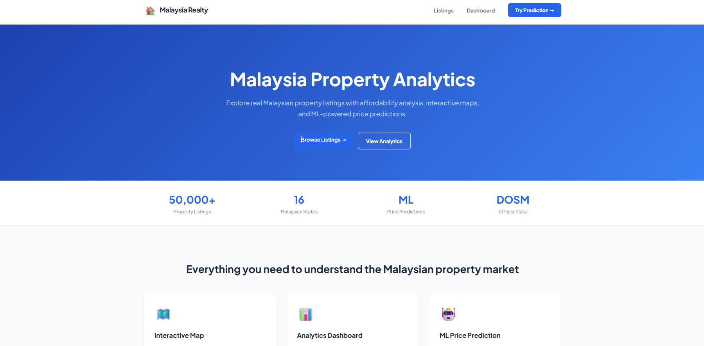
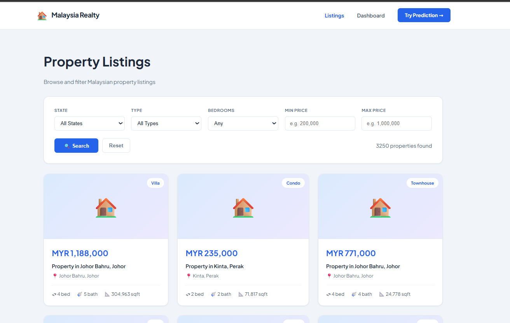
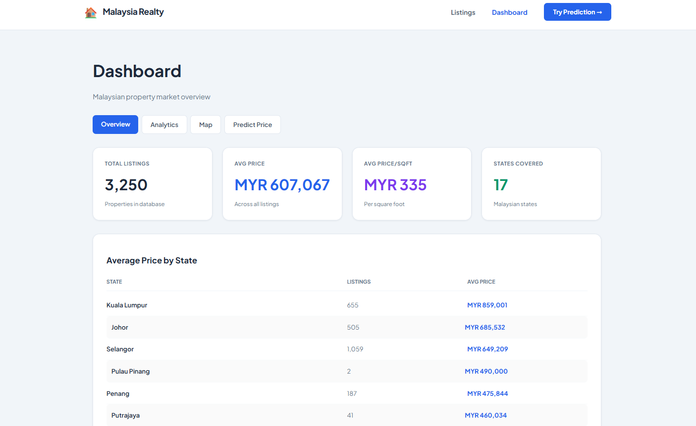

# 🇲🇾 Malaysia Realty Analyzer

A full-stack property analytics platform combining real Malaysian real estate listings with official government demographic data — featuring interactive maps, Plotly-powered charts, and a live ML price predictor.

> **Portfolio project** by [Muhammad Naufal](https://github.com/YOUR_USERNAME) · Selangor, Malaysia


---

## 📸 Screenshots





---

## 🏗️ Architecture

Three independent services in a monorepo, deployed on a single VPS behind Nginx:

```
Browser
  │
  └── Nginx (SSL termination + routing)
        ├── /          → Nuxt 4 Frontend     :3000  (SSR/CSR/SSG hybrid)
        └── /api/*     → Laravel 12 API      :8000
                             │
                             └── Python FastAPI    :8001  (internal only)
                             └── PostgreSQL 16     :5432  (internal only)
```

**Key architectural decision:** The frontend only ever talks to Laravel. Laravel proxies analytics requests to Python internally. This means Python is never exposed to the internet — it lives on a private Docker network.

### Services

| Service | Tech | Port | Exposed |
|---|---|---|---|
| Frontend | Nuxt 4 + Pinia + Leaflet + Plotly | 3000 | Via Nginx only |
| Backend API | Laravel 12 + Sanctum | 8000 | Via Nginx `/api` |
| Analytics/ML | Python FastAPI + Scikit-learn | 8001 | Internal only |
| Database | PostgreSQL 16 | 5432 | Internal only |

---

## ✨ Features

**Public pages (SSR — Google-indexed)**
- Property listings grid with filters (state, type, tenure, bedrooms, price range)
- Sortable, paginated (20/page)
- Individual property detail page with similar listings

**Analytics Dashboard (CSR)**
- KPI overview: total listings, avg price, top states
- 5 Plotly charts: price trends, distribution histogram, PSF box plot, type breakdown, affordability bar
- Demographic cross-analysis: median income vs property prices by state (DOSM data)
- Correlation matrix heatmap

**Interactive Map**
- Leaflet choropleth: Malaysian states coloured by average price/sqft
- Property heatmap layer
- Click state → popup with state summary

**ML Price Predictor**
- Inputs: state, city, type, sqft, bedrooms, bathrooms, tenure, furnishing
- Returns: predicted price + confidence interval (low/high range)
- Displays model accuracy stats (MAE, R²) alongside every prediction

---

## 🧠 Machine Learning

### Pipeline

```
MySQL DB
  │
  ├── Raw property listings (1,108 rows from Kaggle)
  ├── DOSM demographics (303 rows — median income by state)
  │
  └── train_model.py
        ├── JOIN properties + demographics on state
        ├── Feature engineering: One-Hot Encoding for categorical fields
        │   (state, city, property_type, tenure, furnishing)
        ├── Merge mean household income as numeric feature
        ├── Outlier removal: IQR method (drops extreme luxury/commercial anomalies)
        │   1,108 rows → 1,066 rows after cleaning
        ├── Train RandomForestRegressor (100 estimators, Scikit-learn 1.6)
        └── Save → price_model.pkl
```

### Results

| Metric | Value | Notes |
|---|---|---|
| MAE | MYR 86,073 | Average prediction error |
| R² | 0.605 | Model explains 60.5% of price variance |
| Training rows | 1,066 | After IQR outlier removal |
| Features | ~40 | After one-hot encoding |

**Honest assessment:** R² of 0.605 is below the target of 0.75. The bottleneck is dataset size — 1,066 rows is limited for a Random Forest with ~40 features after encoding. The model improves meaningfully with more data; the pipeline is correct and the predictions are directionally accurate.

---

## 🗄️ Data Sources

| Source | Dataset | Rows | License |
|---|---|---|---|
| [Kaggle](https://www.kaggle.com/) | Malaysia House Price Data 2025 (iProperty/PropertyGuru scrape) | 2,000 (1,066 after cleaning) | Public |
| [data.gov.my / DOSM](https://data.gov.my/) | Household income by state — median & mean | 303 | Open Government Data |
| [GADM](https://gadm.org/) | Malaysia state boundary GeoJSON | — | Free for non-commercial use |

---

## 🔌 API Reference

All endpoints are on Laravel (port 8000). Python endpoints are internal and not directly accessible.

### Properties

```
GET  /api/properties                  Paginated listing with filters
GET  /api/properties/{id}             Single property
GET  /api/properties/{id}/similar     Similar listings (±30% price, same state + type)
GET  /api/properties/stats/summary    KPI cards (total, avg price, by state)
```

**Filter params for `/api/properties`:** `state`, `city`, `property_type`, `tenure`, `bedrooms`, `min_price`, `max_price`, `sort_by`, `sort_dir`, `page`

### Analytics (proxied to Python)

```
POST /api/analytics/predict           ML price prediction
GET  /api/analytics/trends/{state}    Plotly price trend chart
GET  /api/analytics/distribution      Plotly price histogram
GET  /api/analytics/affordability     Affordability ratio by state
GET  /api/analytics/correlation       Pearson feature correlation matrix
GET  /api/analytics/demographic       DOSM income vs price cross-analysis
GET  /api/analytics/map/choropleth    State-level analytics for Leaflet
GET  /api/analytics/map/heatmap       [lat, lng, intensity] listing density
```

### Import

```
POST /api/import/properties           Upload Kaggle CSV
POST /api/import/dosm                 Upload DOSM CSV
GET  /api/import/status               Row counts per table
```

---

## 🗃️ Database Schema

```sql
-- properties (from Kaggle CSV)
id, title, state, city, area, property_type, tenure,
price DECIMAL(15,2), price_per_sqft, size_sqft,
bedrooms, bathrooms, car_parks, furnishing,
lat, lng, listed_at, created_at, updated_at

-- dosm_demographics (from data.gov.my)
id, state, district, year, population,
median_household_income, mean_household_income,
unemployment_rate, urbanisation_rate, population_density,
created_at, updated_at

-- prediction_logs
id, input_features JSONB, predicted_price, model_version, created_at
```

---

## 🚀 Local Development

### Prerequisites

- PHP 8.3 + Composer
- Node.js 20+
- Python 3.13 + pip
- MySQL (local dev) or PostgreSQL (production)

### Setup

**1. Clone**
```bash
git clone https://github.com/YOUR_USERNAME/malaysia-realty-analyzer.git
cd malaysia-realty-analyzer
```

**2. Laravel API**
```bash
cd laravel-api
composer install
cp .env.example .env
php artisan key:generate
# Edit .env: set DB_DATABASE, DB_USERNAME, DB_PASSWORD, PYTHON_SERVICE_URL
php artisan migrate
php artisan serve  # runs on :8000
```

**3. Python Service**
```bash
cd python-service
python -m venv venv
source venv/Scripts/activate  # Windows Git Bash
# source venv/bin/activate     # Mac/Linux
pip install -r requirements.txt
cp .env.example .env
# Edit .env: set DB credentials
python train_model.py          # generates price_model.pkl
uvicorn main:app --reload --port 8001
```

**4. Nuxt Frontend**
```bash
cd nuxt-frontend
npm install
cp .env.example .env
# Edit .env: NUXT_PUBLIC_API_BASE=http://localhost:8000
npm run dev  # runs on :3000
```

**5. Import data**
```bash
cd laravel-api
# Via Postman or curl:
# POST http://localhost:8000/api/import/properties  (upload Kaggle CSV)
# POST http://localhost:8000/api/import/dosm        (upload DOSM CSV)
```

---

## 🐳 Docker (Production)

```bash
# Build and start all 4 containers
docker compose -f docker-compose.prod.yml up -d --build

# Run migrations
docker compose exec laravel-api php artisan migrate

# Import data
docker compose exec laravel-api php artisan import:properties

# Train ML model
docker compose exec python-service python train_model.py

# Check all containers are healthy
docker compose ps
```

---

## ⚙️ DevOps

| Component | Choice | Reason |
|---|---|---|
| VPS | Hostinger KVM 2 (2 vCPU, 8GB RAM) | Affordable, full root access |
| Reverse proxy | Nginx (host-level, not containerised) | SSL termination + routing before Docker |
| SSL | Let's Encrypt + Certbot | Free, auto-renews |
| CI/CD | GitHub Actions | 3 workflows: deploy, PR checks, nightly DB backup |
| Containers | Docker + Compose | Consistent dev/prod parity |

**GitHub Actions workflows:**

- `deploy.yml` — push to `main` → test → build Docker images → SSH into VPS → pull + restart
- `pr-checks.yml` — PHP Pint + Python Ruff + ESLint on every PR
- `backup.yml` — nightly PostgreSQL dump at 2AM UTC, uploaded to GitHub artifacts

---

## 🗂️ Project Structure

```
malaysia-realty-analyzer/
├── .github/workflows/          CI/CD pipelines
├── laravel-api/                Laravel 12 REST API
│   ├── app/Http/Controllers/   PropertyController, AnalyticsController, ImportController
│   ├── app/Models/             Property model with query scopes
│   ├── app/Services/           PythonAnalyticsService (HTTP client)
│   └── database/migrations/    3 tables: properties, dosm_demographics, prediction_logs
├── python-service/             FastAPI microservice
│   ├── routers/                predictions, charts, stats, geodata, etl
│   ├── services/db.py          SQLAlchemy connection + query_df() helper
│   └── train_model.py          Random Forest training script
├── nuxt-frontend/              Nuxt 4 frontend
│   ├── app/pages/              listings/ (SSR), dashboard/ (CSR)
│   ├── composables/            useProperties.ts, useAnalytics.ts
│   └── stores/                 propertyStore.ts, authStore.ts
├── nginx/realty.conf           Nginx with rate limiting + security headers
├── scripts/setup-vps.sh        One-command fresh VPS setup
├── docker-compose.yml          Development (hot reload)
└── docker-compose.prod.yml     Production (internal networks, healthchecks)
```

---

## 📊 Non-Functional Targets

| Metric | Target | Notes |
|---|---|---|
| SSR listing page load | < 2s | Measured in browser DevTools |
| ML prediction response | < 3s | Includes DB query + inference |
| API rate limiting | 30 req/min general, 10 req/min predict | Nginx-level |
| ML R² score | > 0.75 | Currently 0.605 — dataset size limited |
| ML MAE | < MYR 150,000 | Currently MYR 86,073 ✅ |
| SSL grade | A on ssllabs.com | Let's Encrypt |

---

## 🛠️ Key Technical Decisions

**Why proxy Python through Laravel instead of calling it directly from the frontend?**
Security. The Python service has no authentication. Routing all requests through Laravel means Python is on a private Docker network, never reachable from the internet — and Laravel can add rate limiting and auth checks before forwarding.

**Why PostgreSQL on production but MySQL locally?**
Development was faster on MySQL (local WAMP setup). PostgreSQL was chosen for production due to better analytics support: window functions, JSONB columns, and percentile queries. The switch happens at deployment via the production `.env`.

**Why Leaflet instead of Google Maps / ArcGIS?**
Zero cost, no API key, no rate limits. The GADM GeoJSON boundaries + OpenStreetMap tiles provide everything needed for a choropleth map of Malaysia without any vendor dependency.

**Why is the ML model trained on the server rather than committed to Git?**
The `.pkl` file is ~50MB and changes every time you retrain. Git is for code, not binary blobs. The `train_model.py` script is committed, and the model is regenerated on the VPS after deployment.

---

## 📝 License

MIT — free to use as a reference for your own portfolio projects.

---

*Built with Laravel, Nuxt, FastAPI, PostgreSQL, Docker, and a lot of `php artisan tinker`.*
